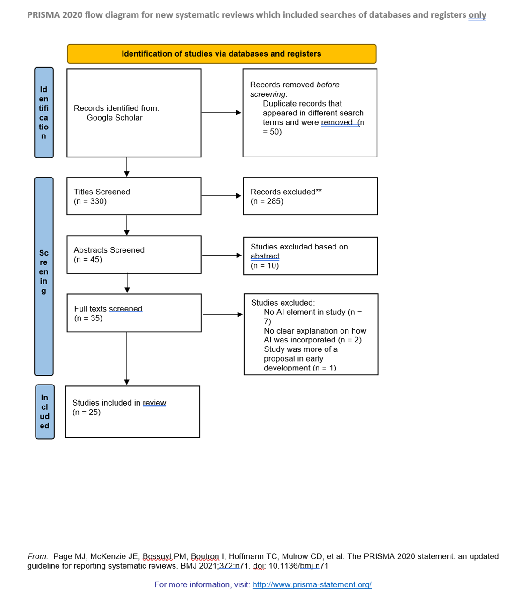

---
# Poster Title, Dimensions and Fonts
title: 
  "Can AI enhance VR training? A systematic review of AI-VR training research."
poster_height: 
  "38in"
poster_width: 
  "45in"
font_family: 
  Palatino
titletext_fontfamily: 
  Palatino

# Author Information
author:
  - name: Michael DeFabiis
    affil: 1
  - name: Kevin Askew
    affil: 1
  - name: Valerie Sessa
    affil: 1

affiliation:
  - num: 1
    address: Montclair State University
    

# Output Format
output: posterdown::posterdown_html

# Main Color Scheme
primary_colour: 
  "#d1190d"
secondary_colour: 
  "#f4f4f4"
accent_colour:
  "#e84a3c"

# Poster Body
column_numbers: 3
sectitle_bgcol: "#e84a3c"
---

# Introduction

**Very little research** exists highlighting the presence or absence of training best practices.

`RQ 1:` Are the current VR and AI training programs utilizing best practices from the science of training?

`RQ 2:` Are current studies on AI-enhanced VR training programs utilizing a proper control group?

`RQ 3:` Do current studies on AI-enhance VR training programs have a sufficient number of people to make inferences about their effectiveness?

`RQ 4:` What are the preliminary findings? Does adding AI to VR training result in a better experience for the trainee, greater learning, or better on-the-job performance than regular VR training?

# Methods

{width="1400"}

# Results
